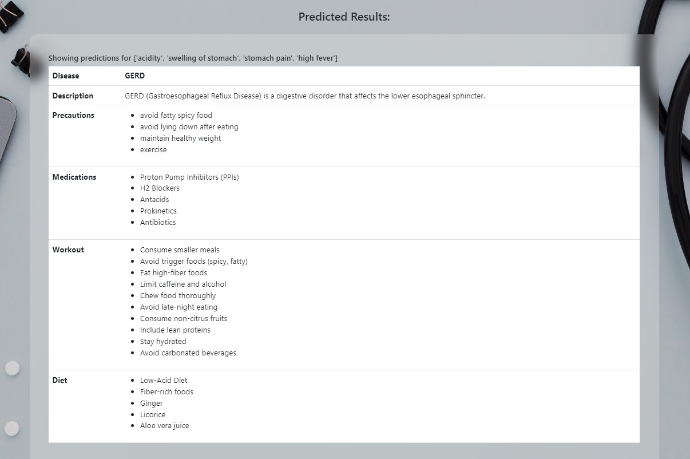

# Disease Prediction and Medical Recommendation System 🩺

[](https://www.python.org/)
[](https://flask.palletsprojects.com/)
[](https://scikit-learn.org/)
[]()

A sophisticated machine learning-powered web application that identifies potential diseases based on user symptoms and provides personalized medical recommendations including medications, diets, exercises, and precautions.

---

## 📋 Table of Contents
- [Overview](#-overview)
- [Key Features](#-key-features)
- [System Architecture](#️-system-architecture)
- [Technologies Used](#-technologies-used)
- [Model Performance](#-model-performance)
- [Project Structure](#-project-structure)
- [Installation & Setup](#-installation--setup)
- [Usage Guide](#-usage-guide)
- [Screenshots](#-screenshots)
- [Disclaimer](#-disclaimer)

---

## 🔍 Overview
MedPredict.Ai leverages advanced machine learning algorithms to bridge the gap between symptoms and medical insights. By analyzing 132 different symptoms, the system can predict 41 distinct diseases with high precision, offering a preliminary health assessment tool.

## ✨ Key Features
- **🎯 Highly Accurate Prediction**: Utilizes an optimized Random Forest Classifier.
- **🔡 Intelligent Symptom Matching**: Implements **FuzzyWuzzy** string matching to handle typos and varied symptom naming (e.g., "head ache" vs "headache").
- **🥗 Holistic Recommendations**:
  - **Disease Context**: Detailed descriptions for each predicted condition.
  - **Medication**: Suggested pharmacological treatments.
  - **Dietary Plans**: Tailored nutritional advice based on the disease.
  - **Exercise/Workout**: Suggested physical activities to support recovery.
  - **Precautions**: 4 key preventive steps for every condition.
- **🎨 Responsive UI**: Modern frontend built with Bootstrap 5 for a seamless mobile and desktop experience.

## 🏗️ System Architecture
1. **Data Collection**: 8+ CSV files containing disease-symptom mappings, descriptions, and recommendations.
2. **Preprocessing**: Symptom vectorization and fuzzy matching for user input.
3. **ML Engine**: A pre-trained `RandomForest.pkl` model serialized via Pickle.
4. **Flask Backend**: Handles routing, prediction logic, and data retrieval.
5. **Dynamic Frontend**: Renders results instantly using Jinja2 templates.

## 🚀 Technologies Used
- **Backend Core**: Python 3.x, Flask
- **Machine Learning**: Scikit-learn, NumPy, Pandas
- **Natural Language**: FuzzyWuzzy (Levenshtein Distance)
- **Frontend**: Bootstrap 5, FontAwesome, HTML5, CSS3
- **Dev Tools**: Jupyter Notebook (for model training), Pickle (serialization)

## 📊 Model Performance
During development and testing, the models were evaluated on a comprehensive medical dataset:
- **Random Forest**: ~100% Accuracy (Selected for Production)
- **SVC**: ~100% Accuracy
- **Gradient Boosting**: ~100% Accuracy

*Note: 100% accuracy is achieving on the provided curated dataset; real-world performance may vary.*

## 📂 Project Structure
```text
MedPredict.Ai/
├── dataset/                    # Medical knowledge base
│   ├── Training.csv            # ML Training data
│   ├── symptoms_df.csv         # Symptom mapping
│   ├── description.csv         # Disease details
│   ├── medications.csv         # Medication data
│   ├── diets.csv               # Nutritional advice
│   ├── workout_df.csv          # Exercise routines
│   └── precautions_df.csv      # Preventive measures
├── model/                      # Serialized ML models
│   └── RandomForest.pkl
├── static/                     # CSS, JS, and Media
├── templates/                  # HTML (Jinja2) templates
│   └── index.html
├── screenshots/                # App UI previews
├── main.py                     # Primary Flask server
├── disease_prediction_system.ipynb  # Training & EDA
└── requirements.txt            # Project dependencies
```

## ⚙️ Installation & Quick Start

Follow these steps to get the project running locally:

### 1. Clone the Repository
Open your terminal and run:
```bash
git clone https://github.com/Amarjeet9305/MedPredict.Ai.git
cd MedPredict.Ai
```

### 2. Physical Environment Setup (Recommended)
Create and activate a virtual environment to manage dependencies:
```bash
# Windows
python -m venv venv
venv\Scripts\activate

# macOS/Linux
python3 -m venv venv
source venv/bin/activate
```

### 3. Install Dependencies
Install all required Python libraries:
```bash
pip install -r requirements.txt
```

### 4. Run the Application
Start the Flask development server:
```bash
python main.py
```

### 5. Access the Web App
Once the server is running, open your browser and navigate to:
**[http://localhost:5000](http://localhost:5000)**

## 📱 Usage Guide
1. Enter your symptoms in the search bar (e.g., "chills, high_fever, headache").
2. The system will auto-correct typos using fuzzy matching.
3. Click **Predict** to see the diagnosis and detailed recommendations.
4. Explore the tabs for Description, Precautions, Medications, Diet, and Workout.

## 📸 Screenshots


---

## 👥 Developer
- **Amarjeet** - *Lead Developer*

## ⚠️ Disclaimer
**IMPORTANT**: This application is for **educational and informational purposes only**. The predictions generated by the AI are not a substitute for professional medical diagnosis. Always consult a certified healthcare provider for medical concerns.

---
© 2026 MedPredict.Ai | Empowering Health through AI
